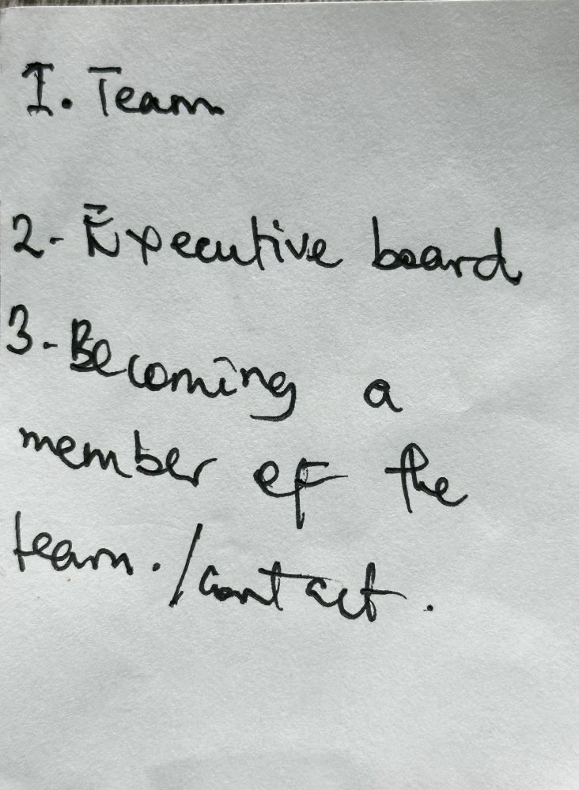
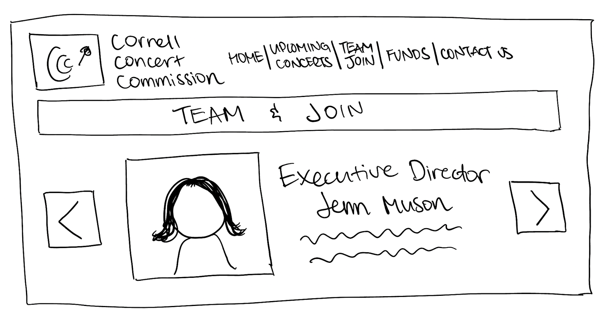
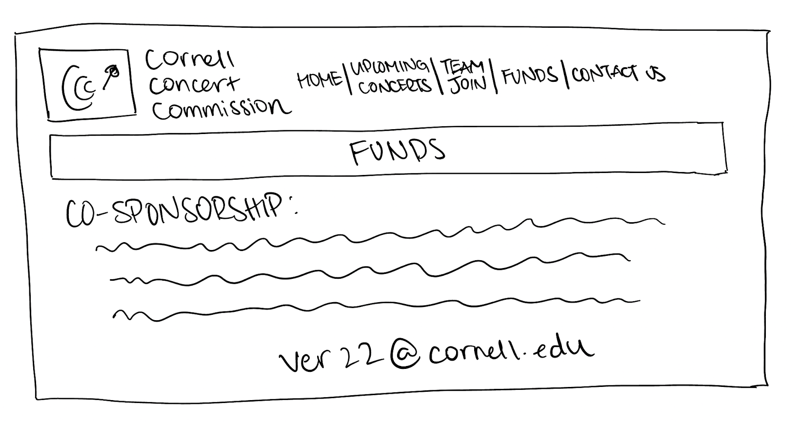

# Group Project: Design Journey

**For each milestone, complete only the sections that are labeled with that milestone.** Refine all sections before the final submission.

You are graded on your design process. If you later need to update your plan, **do not delete the original plan, leave it in place and append your new plan _below_ the original.** Then explain why you are changing your plan. Any time you update your plan, you're documenting your design process!

**Replace ALL _TODOs_ with your work.** (There should be no TODOs in the final submission.)

Be clear and concise in your writing. Bullets points are encouraged.

**Everything, including images, must be visible in _Markdown: Open Preview_.** If it's not visible in the Markdown preview, then we can't grade it. We also can't give you partial credit either. **Please make sure your design journey should is easy to read for the grader;** in Markdown preview the question _and_ answer should have a blank line between them.


## Client (Milestone 1)

### Client Description (Milestone 1)
> Tell us about your client. Who is your client?
> Explain why your client meets the client rules in the project requirements.


Our client is Cornell Concert Commission. A club at Cornell University that organizes concerts on campus.

Our client meets the project requirements for the following reasons:

- We are not our own client
- No team members have a direct, personal connection
- The client needs a static website


### Client Questionnaire (Milestone 1)
> Develop a client questionnaire to learn more about your client and their goals.
> You may use the questionnaire below, you may modify the questionnaire below, or you may create your own.

1. Describe your organization and its purpose.

    CCC is a student run organization dedicated to putting concerts on campus for Cornell students and others to enjoy.

2. What makes your organization and its services special or unique?

    They bring in well established artist outside of the university's sphere. Culturally, there is no other club on campus like it.

3. Why are you looking for a new website or updating your existing site?

    The preexisting website is a Cornell blogs website that has a limit to adding and expanding the features. The current structure makes it difficult.

4. Who do you want to visit your site? Who do you believe is your website's intended audience?

    Anyone looking for information on the organiztion whether that be club members or people interested in joining. It aslo doesnt have good SEO, so anyone being able to find it would be good.

5. When visiting your site, what actions do you want your visitors to take?

    Want them to be able to see information about upcoming shows, access social media, history of the shows, general description of the club, contact link, a spot for blogs so memebers of the club can have stuff reach the community.

6. What are your goals for this site?

    Have one that looks better and is more dynamic, easy to update/add new content.

7. Is there a "feel" that you want for your site? Are there colors or imagery that you have in mind?

    The current aesthetic of the club is a black and white feel. The logo is similar to a record, so they want the website to adopt the record syle of classic, clean cut, old school vinyl. (want to see mockups for aesthetic)

8. What are your three favorite competitors or similar organizations' websites? Why?

    pitchfork - inspiration for blogs portion
    They do not have any other websites that currently come to mind.

9. Is there anything you think the website is missing?

    They would like a merch page.

### First Client Meeting Minutes/Notes (Milestone 1)
> Include your notes/minutes from your first meeting with your client.

The first meeting was about 15 minutes. The client and I(Kyrah) discussed the questions above along with what both of our roles will be during this time. I let the client know that we will be reching out to them sometime next week to show the our progress.


### Client Website (Milestone 1)
> Tell us about the website that your client wants.
> Tell us the purpose of the website and what it is all about.
> Note: **If you are redesigning an existing website, give us the current URL and some screenshots of the current site.** (FireFox makes it easy to take a full screenshot of a page from the context menu (right click).)
> If you are redesigning an existing site, tell us how you plan to update the site in a significant way that meets the project's requirements.

Our client wants a website that is an expansion of their current website, yet still follows a similar aesthetic. They want a website that makes it easy for their audieence to find information and navigate the page. They want a website that will be easily accessible to their intended audience and something that is dynamic and easily updatable.

This website is designed for the Cornell Concert Commision, a club on the Cornell campus that brings artists from across the country to perform for students and others who would liek to see them perform. The purpose of the website is to that the club can get more visibilty and both members and people interested in becoming a member can find the information they want easily.

Client's current website:
<https://blogs.cornell.edu/concerts/>

Cornell Concert Commission site screenshots:


### Client Goals (Milestone 1)
> Identify your client's goals for the website.
> What kind of website do they want? What are their goals for the site?
> There is no required number of goals. You need as many goals as necessary to reflect your client's desires.

- They want an update to thier current website so it is more dynamic and information can be updated easily.
- They want a black and white aesthetic with an old school, vinyl feel.
- They would like the addition of the merch page to show off club merchandise for purchase.
- They want the website the be easily accessible for anyone who wants to view it.


### Client Website Scope (Milestone 1)
> We want your project to be successful! It needs to be ambitious, but not too large.
> A good rule-of-thumb is that you should have about 1 content-full page for each team member.
> Explain why the website you will create for your client isn't too small and isn't too big.
> Explain why you think it's the right size for this project.

This website for CCC is the right "size" for this project because it's not too big and not too small. It's being designed for Cornell students and may have thousands of users, but the website requirements based on the client goals don't require a level of design/coding that is outside the scope of this coure project. It is still reasonably ambitious because the client wants their website to be more dynamic which would challenge our knowledge of JavaScript and CSS which we have not gotten to learn as much as we have HTML. The current website has 5 webpage, some of which have subpages. Redesigning a website of this size is an adequate amount of work for a group of four. Therefore, it is the right size for the project.


## Plan/Schedule (Milestone 1)
> Make a plan of when you will complete all parts of this assignment.
> This plan is for your team. There is no required format. Format it so that it works for you!
> Your plan should include when you will interview users and analyze their goals.
> Your plan should also include how and when you will assemble/create the sit's content.
> **Tip:** Your team should plan to work ahead. This project really isn't feasible to complete the night before a deadline.

- PGM1: done by Tuesday, October 25
- ZOOM: week of October 31st
- ZOOM: week of November 7th
- PGM2: done by Sunday, November 13
- ZOOM: week of November 14th
- ZOOM: week of November 21st
- PGFIN: done by Tuesday, November 29

## Understanding Users (Milestone 2)

**Make the case for your decisions using concepts from class, as well as other design principles, theories, examples, and cases from outside of class.**

You can use bullet points and lists, or full paragraphs, or a combo, whichever is appropriate. The writing should be solid draft quality, but it doesn't have to be fancy.


### User Interview Questions (Milestone 2)
> Plan the user interview which you'll use to identify the goals of your site's audience. (Lana)
> You may use the interview template below and revise it as much as you desire.

**User Interview Briefing & Consent:** "Hi, I am a student at Cornell University. I'm currently taking a class on web design and for a project, I am designing the website for the Cornell Concert Commision. I'm trying to learn more about the people that might use this site. May I ask you a few questions? It will take about 10 minutes. You are free to quit at any time."

1. Please tell me a bit about yourself. You may omit any personal or private information.
2. Have you been to any concerts at Cornell _If yes, recall the last concert you attended... proceed with following questions with Cornell specific experience if one exists._
3. **Recall the last concert you went to.** How did you find out about it?
4. If it was via the internet, what sort of device were you using?
5. Once you found out about it, did you seek additional information?
6. ...If yes, what additional information did you seek?
7. ...How/where did you find the additional information?
8. Did you find all the information you needed from one source? If yes, what was the source. If no, please explain and describe the process.
9. How did you purchase or obtain a ticket?
10. Once you were at the concert, did you need to seek out any additional information? If yes, what and how did you go about it?
11. What haven't I asked you today that you think would be valuable for me to know?

**After the interview:** "This was really helpful. Thank you so much for agreeing to speak with me today. Have a great day!"


### Interview Notes (Milestone 2)
> Interview at least 1 person for every member of your team from your audience.
> Take notes and include those notes here. Make sure to include a brief description of each interviewee.
> **Copy the interview questions above into each interviewee section below.**
> Take notes for each participant inline with the questions.

**Interviewee 1:**

Noor Ahmed is a senior in the College of Agriculture and Life Science. She is studying biology and is on a pre-med track. She's been to a few concerts in her life, and plans on attending more in the near future.

1. Please tell me a bit about yourself. You may omit any personal or private information.
   - I am a senior in CALS studying biology. I'm on a pre-med track and am planning on applying to medical school or a grauate program for public health.
2. **Recall the last concert you went to.** How did you find out about it?
   - A boogie w a hoodie. It's my sisters favorite artist at the moment so I got tickets for her birthday. She sent me his instrgram bio about where to buy the tickets
3. If it was via the internet, what sort of device were you using?
   - laptop, used the ticketmaster website
4. Once you found out about it, did you seek additional information?
   - yes
5. ...If yes, what additional information did you seek?
   - date, time, location, how to get there
6. ...How/where did you find the additional information?
   - on the webiste where the tickets are purchased, how much, how many availabkle, etc
7. Did you find all the information you needed from one source? If yes, what was the source. If no, please explain and describe the process.
   - yes
8. How did you purchase or obtain a ticket?
   - Purchased it through the website, which allows you to put in credit card info. They then emailed the digital ticket but its also available on the website/mobile application. If your download the app, you can have it on your mobile device through the app.
9. Once you were at the concert, did you need to seek out any additional information? If yes, what and how did you go about it?
    - Yes. We also paid for the meet and greet, so we needed to find out where it is and also how to get from there to the performance stage. We found this out by looking around at the posted signs and also asking people that were nearby.
10. Is there anything else you'd like to add?
    - no


**Interviewee 2:**

This interviewee is a sophomore Cornell student who is studying hotel administration. She is from London and went to boarding school in California. SHe plays for the Cornell polo team and has an older brother.

1. Please tell me a bit about yourself. You may omit any personal or private information.
   - She is a sophomore hotellie on the polo team. SHe went to a boarding school in California, grew up in London and has an older brother
2. **Recall the last concert you went to.** How did you find out about it?
   - The last concert she went to was for Mark Knophler. She took her dad for his birthday in Santa Barabra after looking it up.
3. If it was via the internet, what sort of device were you using?
   - She was using a computer
4. Once you found out about it, did you seek additional information?
   - Yes, she did
5. ...If yes, what additional information did you seek?
   - She looked for the songs he was most liekly to perform
6. ...How/where did you find the additional information?
   - She found it on blogs
7. Did you find all the information you needed from one source? If yes, what was the source. If no, please explain and describe the process.
   - Yes, she did from a blog
8. How did you purchase or obtain a ticket?
   - She bought it from the venue's websited.
9. Once you were at the concert, did you need to seek out any additional information? If yes, what and how did you go about it?
   - She did not look for anything.
10. Is there anything else you'd like to add?
    - She said no.

**Interviewee 3:**


**User Interview Briefing & Consent:** "Hi, I am a student at Cornell University. I'm currently taking a class on web design and for a project, I am designing the website for the Cornell Concert Commision. I'm trying to learn more about the people that might use this site. May I ask you a few questions? It will take about 10 minutes. You are free to quit at any time."

1. Please tell me a bit about yourself. You may omit any personal or private information.

- 20 yrs old, Junior Hotelie. Transferred from Davidson last spring. Belongs to an a cappella group, enjoys social events but not a partier.

2. Have you been to any concerts at Cornell _If yes, recall the last concert you attended... proceed with following questions with Cornell specific experience if one exists._

- Yes


3. **Recall the last concert you went to.** How did you find out about it?

- Went to soccer mommy on campus
- Heard about it from her friend who is on ccc board


4. If it was via the internet, what sort of device were you using?

- laptop

5. Once you found out about it, did you seek additional information?

- yes

6. ...If yes, what additional information did you seek?

- wanted to know more about the band and the event, date, time, ticket information. Wanted to take her boyfriend who is not a cornell student

7. ...How/where did you find the additional information?

- sought out some info about the concert once she heard about it... googled "soccer mommy cornell"

8. Did you find all the information you needed from one source? If yes, what was the source. If no, please explain and describe the process.

- no
- read about event on ccc website, then had to go to a diff website to reserve her ticket, and a third site to purchase a ticket for her boyfriend

9. How did you purchase or obtain a ticket?

- had to reserve a ticket on a different website for cornell students, then purchase a ticket for boyfriend from another site

10. Once you were at the concert, did you need to seek out any additional information? If yes, what and how did you go about it?

- no

11. What haven't I asked you today that you think would be valuable for me to know?

- Was annoying to have to go to three diff websites

**After the interview:** "This was really helpful. Thank you so much for agreeing to speak with me today. Have a great day!"


**Interviewee 4:** Jeph

tell us a bit about your participant
The participant named Fifi is a cornell freshman majoring in computer science and minoring in the school of Engineering. He is 20 years. He comes from Ghana but has lived in Germany in the past 2 years. He is very black in complexion.

take notes inline with questions

**User Interview Briefing & Consent:** "Hi, I am a student at Cornell University. I'm currently taking a class on web design and for a project, I am designing the website for the Cornell Concert Commision. I'm trying to learn more about the people that might use this site. May I ask you a few questions? It will take about 10 minutes. You are free to quit at any time."

1. Please tell me a bit about yourself. You may omit any personal or private information.
My name is Fifi. I am a cornell freshman of age 20 who major Computer science in the college of engineering. I come from Ghana and high schooled at Presec Legon, in Ghana and UWC, in Germany. I like watching movies, listening to all kinds of music, watching soccer, playing soccer, watching basketball, and yoga.


2. Have you been to any concerts at Cornell _If yes, recall the last concert you attended... proceed with following questions with Cornell specific experience if one exists._

- No

3. **Recall the last concert you went to.** How did you find out about it?

- I got some of the information from my friends. I didn't want to go because it was my first time to go to a concert. I saw a flier of the party in a bathroom and the flier had my friends on it and it looked fun and interesting to me so I decided to go to the concert because of I wanted to see my friends perform.

4. If it was via the internet, what sort of device were you using?

I got other information through my school's instagram using my phone.

5. Once you found out about it, did you seek additional information?

Yes

6. ...If yes, what additional information did you seek?

As it was approaching, I sought out the duration, location, performers, and information about whether food would be shared at the concert.

7. ...How/where did you find the additional information?

From people(friends)

8. Did you find all the information you needed from one source? If yes, what was the source. If no, please explain and describe the process.

Yes

9. How did you purchase or obtain a ticket?

It was free. Friends told me that it was free

10. Once you were at the concert, did you need to seek out any additional information? If yes, what and how did you go about it?

If there was gonna be food.


n. What haven't I asked you today that you think would be valuable for me to know?

I wanted to share with my friends through social media pictures of mine taken at the concert but we were advised not to.

**After the interview:** "This was really helpful. Thank you so much for agreeing to speak with me today. Have a great day!"


### Goals (Milestone 2)
> Analyze your audience's goals from your notes above.
> List each goal below. There is no specific number of goals required for this, but you need enough to do the job (Hint: It's more than 1 and probably more than 2).

Goal 1: Easily access information on upcoming shows

- **Design Ideas and Choices** _How will you meet those goals in your design?_
  - We will meet this goal by having all of the upcoming shows in an area that is clearly designated for the new shows. This will make it easily denotable for our audience to find the information for the shows wuhc as when it is, who s performing, and where it will be.
- **Rationale & Additional Notes** _Justify your decisions; additional notes._
  - The reasoning for this goal is becuase the primary function of the organization is to put on concerts for the COrnell community. This makes it very important for the audience to know the timing of these events and other important information surrounding it.

Goal 2: Club information

- **Design Ideas and Choices** _How will you meet those goals in your design?_
  - We will meet this goal in our plan by adding information about the club aspect of this organization. This information would include the current executive board of the club and how they can join.
- **Rationale & Additional Notes** _Justify your decisions; additional notes._
  - The user should not have to search for the information they need to meet their goals

Goal 3: Obtain information about how/when/where to obtain concert tickets

- **Design Ideas and Choices** _How will you meet those goals in your design?_
  - We will create a structured template that contains pertinent information about each concert
  - This template will include key, important information that will meet this goal
  - Follow common design patterns regarding where humans tend to look first, etc.
- **Rationale & Additional Notes** _Justify your decisions; additional notes._
  - Creating a template structure for how each concert's key information is displayed promotes usability through consistency


### Audience (Milestone 2)
> Briefly explain your site's audience.
> Be specific and justify why this audience is a **cohesive** group with regard to your website.

Our website's cohesive audience is Cornell students interested in finding more information regarding the Cornell Concert Commission. The audience is either looking to access what the club has to offer such as concerts and concert hisory or joinging the organization.


## Website Design Exploration (Milestone 2)

Identify three websites (preferably static websites) that exist today on the web to draw inspiration from. Please select websites that are similar to the website you wish to create.

Include two screenshots of the home page for each site: narrow and wide.

**We'll refer to these are your "example websites."**

1. <http://www.universityunion.syr.edu/>

    

    

2. [Princeton University Website](https://concerts.princeton.edu/)

    

    

3. <[New York City Theatre](https://www.newyorkcitytheatre.com/index_concert.php)>

    

    


### Example Website 1 Review (Milestone 2)
> Review the website you identified above. (1 paragraph)
> In your review, include a discussion common design patterns and interactivity in the site.

Overall, this website has good design and interactivity that allow users to achieve their goals. The organization of content in the navigation is logical and give the user plenty of specific options, which minimizes the amount of time and mouseclicks needed to find information. The content also seems to be simplified in a way that uneceswary information isn't included but the user is still able to effectivley achieve their goals. The design is pretty minimalistic and visually appealing, with a blue theme and an aesthetic hero image on the home page that draws the user in. In switching from wide to narrow version of the site, the navigation menu is collapsed into a hamburger menu, which is consistent with common/familiar interactivity design. On the gallery page, there are many interactive carousels used to display different photos from the same event. This is an effective way of organizing the content on the page since there are a lot of images, and this provides a clear division of events and their corresponding photos. Below each carousel, there is a strip which displays smaller versions of the photos in that carousel, allowing users to skip around. This is effective in holding up the usability of the site and making sure that user goals are prioritized in the design. There are several webpages on the site that uses animation to display moving text. While it is visually stimulating, it may affect the usability of the site for users with poor internet connection.


### Example Website 2 Review (Milestone 2)
> Review the website you identified above. (1 paragraph)
> In your review, include a discussion common design patterns and interactivity in the site.

Good alignment and organization( pictures and texts)
Bad feedback for buttons and links
Good visual theme( color, font)
The affordances are not complete.
Visibility


### Example Website 3 Review (Milestone 2)
> Review the website you identified above. (1 paragraph)
> In your review, include a discussion common design patterns and interactivity in the site.

The New York City Theatre is a venue that puts on shows to entertain the New York community. Their wesite home page  features a carousel that displays some of the shows that are coming up. Their wesite also has a dropdown to disply all of the shows that will be coming up in the future. The dropdown is organizaed by month. It has dropdowns in the menu so that tusers can see more options if the one they want is not on screen. All together, these elements allow them to present much information without it being to condensed on the page, making it more appealing for the audience.


## Content Planning (Milestone 2)

Plan your site's content.

### Your Site's Planned Content (Milestone 2)
> List **all** the content you plan to include your website.
> You should list all types of content you planned to include (i.e. text, photos, images, etc.)

- text:

 1. **Main Incoming show:** Cornell Concert Commission along with Alumni Affairs and Development is excited to announce lovelytheband and special guest Indigo De Souza on Saturday, September 24th at 7 pm Homecoming concert. The show will take place in Barton Hall and tickets for students go on sale Friday, September 9th at noon and faculty, staff, alumni, general public go on sale Monday, September 12th at noon. To purchase tickets, visit here!

 2. **Goals:** Cornell Concert Commission is the largest music organization on campus, producing shows YOU want to see, such as KE$HA, Avicii, Passion Pit, Playboi Carti, Phoebe Bridgers, CupcakKe, and more!

 3. **Goals:** Love music? Want to learn about the industry? Maybe you’re craving hands on experience in the entertainment business, or looking for friends in a chill, supportive community! Look no further, because CCC is the org for you!

 4. **Meeting times, media of updates:** Meetings are every Thursday at 5:00 PM in McGraw 165, and new members are welcome anytime. To stay up to date on our latest shows, be sure to like our Facebook Page and follow us on Instagram and Twitter!

 5. **Upcoming Concerts, Artists:** Claire Rosinkranz will be performing at the Cornell Arts Quad, with special guest Izzy Heltai on Sunday, August 28th! Grab your free tickets!

Gus Dapperton will be doing a virtual performance, with special guest Abhi the Nomad on November 14th! RSVP on the Campus Groups event page here!

Peach Pit will be performing in Bailey Hall, with special guest Dayglow on Saturday, February 15th! Grab your tickets here!

A$AP Ferg will be performing with fellow A$AP Mob member A$AP Twelvyy on Sunday, March 24th in Barton Hall! Get your tickets here!

Electric Guest will be performing in Bailey Hall on Saturday, January 26th! Get your tickets here!

6. **Upcoming concerts with Artists:** Mark your calendars for our Saturday, January 26th show at Bailey Hall! Keep an eye out for the official artist announce and follow us on Facebook, Instagram, and Twitter for minute-by-minute updates!

7. **Upcoming concerts with Artists:** Dec 2018 Outside of Cornell Concert Commission, two of our members, Avi and Wyatt, dedicate their time to other musical ventures as well. Featuring The Laurens- read about them below and be sure to check out their performances here!

8. **Info about Laurens:** The Laurens “We are The Laurens, a musical project comprised of: Jesse Smith (Lead vocals & Rhythm guitar), Avinash Patel (Backup vocals & Lead guitar), Zach Silliman (Bass), and Wyatt Westerkamp (Drums & Moral support). Also, Wyatt lives at Eco House. But we’re all Lauren at heart.”> CCC was founded in 1971. It is a unit of the Campus Activities Office, Department of Campus and Community Engagement, and is funded in part by the SA and GPSA.

9. **About:** CCC serves to select, promote, and produce all aspects of popular concerts at Cornell, and provides the Cornell and greater Ithaca community with a diverse range of prominent acts.

10. New members are welcome anytime of the year! General body meetings are held every Thursday at 5:00 PM in McGraw 165. New members must attend 3 consecutive meetings and attend every other meeting afterwards to be an active voting member (but can work shows anytime)!

11. **Team:** Working a Show

CCC members do far more than simply selecting artists to come to Cornell, as all CCC sponsored shows are student produced. The production is split into 6 crews: Security, Stage, Box Office, Merchandise, Hospitality, and Ticket Taking. Members who have attended the most meetings and promoted the event are given preference to their desired crew.

Security - Led by the Executive Director, the security crew is responsible for overlooking the audience at key locations of the venue and securing the backstage area. This crew is a half-day crew.

Stage - Led by the Productions Director, the stage crew is responsible for the setting up and breaking down the stage, lights, and sound of the concert during the day. During the show, the stage crew doubles as security members. This crew is a full-day crew.> Box Office - Led by the Finance Director, the box office is responsible for selling tickets at the door and attending to the will call tickets. This crew is a half-day crew.

Merchandise - Led by the Promotions Director, the merchandise crew is responsible for the selling of any merchandise provided by the artist. The Promotions Director is also responsible for handling press. This crew is a half-day crew.
Hospitality - Led by the Administrative Director, the hospitality crew is responsible for the preparation of the artists’ dressing rooms, as well as providing food for both the crews and the artists. This is a full-day crew.

Ticket Taking - Led by the Selections Director, the ticket takers are responsible for scanning and collecting tickets, as well as confiscating any items that cannot be brought into the venue.> Executive Director: Jenn Muson - The executive director is responsible for supervising the rest of the executive board. She plans future events and the future vision of the organization.

12. **Executive board members:** Productions Director: Maddie Racciatti - The productions director is in charge of securing campus and local services, police, stage equipment, and acts as the primary contact between the organization and the artist’s management. Day of show, she supervises day-of-show operations and the stage crew.

Administrative Director: Lindsey Manos - The administrative director handles day to day housekeeping tasks for the organization by reserving rooms, managing the listserv, and planning social events for members. On day of show she heads the hospitality crew, which provides food and assembles the dressing rooms for the artist.

Finance Director: Victoria Reiter - The finance director oversees the organization’s budget, ensures that ticketing policies are in order, and works with other organizations for the co-sponsorship of events on campus. On day of show, she manages the Box Office and works front-of-house with the Selections Director.

Promotions Director: Noah Braun - The promotions director organizes Clubfest, curates social media, negotiates media correspondences, designs innovative posters and quarter-cards, and promotes concerts on and off campus. During day of show, he runs the merchandise crew and handles press.

Selections Director: Jacobo Ospina - The selections director stays up to date on emerging music trends to bring rising acts to Cornell, working as a liaison between the interests of general body members and the executive board to help select the artists. During shows he manages the ticket taking crew and confiscation room.

13. **Contact:** The best way to have your voice heard is to join CCC! You can always voice your opinion, and after attending only three (consecutive) meetings you can become a full fledged member. Meetings are every Thursday at 5pm in McGraw 165, and all are welcome anytime of year.

For other inquiries, you can also contact an Executive Board member at jam937@cornell.edu. Make sure to provide your name and e-mail address so we can get back to you as soon as possible!

Follow us on Facebook, Instagram, and Twitter for updates on upcoming shows, promotions, and more!

14. **Funds provision:** CCC is always open to assist funding to outside organizations for the production of musical events. Working alongside organizations such as SPICMACAY, Haven, JAM, and ASHA Cornell, CCC has been able to fund and help produce acts ranging from Bulgarian and Indian folk music to LGBTQ raves. If you are interested in having CCC co-sponsor your organization, please reach out to finance director Victoria Reiter at ver22@cornell.edu.

Once the co-sponsorship is submitted, the CCC e-board will ask a representative of the organization to come to an e-board meeting. There, the representative will be asked to give a presentation of the event, covering the event’s purpose, amount requested, budgeting, promotional plans, and more. If the executive board approves the event, the representative is asked to present once more at the General Body (gbody) meeting. The gbody will ask questions and and ultimately decide whether or not to fund the event, and if so, determine the amount of funding.

- images
- 
- 
- 
- 
- 
- 
- 
- 
- 
- 
- 
- 
- 
- 
- 
- 
- 
- 
- 


### Content Justification (Milestone 2)
> Explain (about a paragraph) why this content is the right content for your site's audience and how the content addresses their goals.

This content is right for our site's audience because it displays all the information they could want on the wesite. It also has visuals for the audience to recognize and better engage with the text content, while breaking it up.


## Information Architecture (Milestone 2)

### Content Organization (Milestone 2)
> Document your **iterations** of iteration of card sorting **and** description of your thought process for each iteration.
> Please physically sort cards; pleas card sorting here. You must have at least 2 iterations of card sorting.
> Include photographic evidence of eache don't try and do this digitally.


**Card 1:** The above card contains quick information about the club. The content of this card are information that the audience might want to find immediately he or she enters the website. As such, these information or content can be grouped together to form perhaps the homepage such that the audience can find these information on the website immediately he or she enters the website.

**Card 2:** The above card has content that are related to the team of the club. The team of the club involves the members, the executives, and the leaders. It could therefore be appropriate to group these content together as they all contain information about the team members of the club. Moreover, the "Becoming a member of the team" content is related to the other content because the audience might want to become part of the team and it would be appropriate to group such content together with the content about the team members of the team. To become part of the team, the audience must reach out to the club. So the contact of the club can be added to this sorted card as well.

**Card 3:** The above card has one( maybe two) information: "Becoming a member of the team"( and contact). The contact and the "becoming a member of the team" can be grouped together because to join the club, the audience needs to reach out to the club members or the executives. As a result, it would be appropriate to add the contact to the "Becoming a member of the team".

**Card 4:** The above card contains information about events or concerts that the club will be organising. The content written on this card all are about the events. These events are upcoming ones and the main upcoming show. Moreover, "Info about Laurens" adds more information about a key word "Lauren" mentioned in the "Upcoming concerts". So it would be great to add the description of the keyword close to where it were mentioned.

**Card 5:** The above card has content about contacting the club. The contact and social media links are have information to promote contacting the team. Grouping these content together can help the audience find contact information quickly.

**Card 6:** The above card has content about getting funds from the club. No other information can be grouped with the content of this card. The card could have had 'contact' as a content but the "Funds provision" content already has contact information so there is no need to add "contact" to this card.

**Card 7:** The above card contains quick information about the club. The content of this card are information that the audience might want to find immediately he or she enters the website. As such, these information or content can be grouped together to form perhaps the homepage such that the audience can find these information on the website immediately he or she enters the website.

### Final Content Organization (Milestone 2)
> Which iteration of card sorting will you use for your website?

tell us which iteration of card sorting you plan to use.

1. Card 1
2. Card 2
3. Card 4
4. Card 5
5. Card 6


> Explain how the final organization of content is appropriate for your site's audiences.

why does this organization make sense for your audience (not you)?
Each card has related content. This will help the audience to easily locate information on the website easily. Also each card has content that are moderately large. This will help the audience to find information quickly on the website and easily navigate through the website.


### Navigation (Milestone 2)
> Please list the pages you will include in your website's navigation.

- Home page
- Upcoming Concerts
- Team & Join
- Get Funds
- Contact Us

changed to:

- home (header and hamburger menu)
- concerts (upcoming and past - interactive tabs)
- team (carousel interactive display)
- blog
- contact us

> Explain why the names of these pages make sense for your site's audience.

explain why the pages name make sense to the audience.

The names are appropriate because each name gives a summary of the content that can be found on the page. The division and organization of content is intuitive and follows standard practices related to content organization on the web.


## Visual Theme (Milestone 2)
> Discuss several (more than two) ideas about styling your site's theme. Explain why the theme ideas are appropriate for your target audiences. Note the theme you selected for your site and why it's appropriate for the audience and their goals.

- One possible theme idea for the site's theme is a minimalisitc theme. This kind of style is becoming increasingly popular across the web and in other industries as well. It would consist of a very basic color scheme, but primarily white. This is a pretty 'quiet' theme and therefore would allow users to pay more attention to the actual content. It's usually the smartest option in terms of usability. This would aid the user in achieveing their goals of findign club information and also easily access information on upcoming shows.
- Another option would be to implement a dark but colorful theme that mimics the color atmosphere that usually associated with concerts. This could be an effective way to stimulate the users senses and provide a more enjoyable experience.
- The site theme could also be chosen in accrodance with Cornell colors, since it is a Cornell-affiliated club website. This could be helpful for the users in terms of clarity, so that there is no question/confusion around whether it is the official site for Cornell concerts. This plays into the second user goal of identifying club information.
- The last option would be to keep the site theme the same as the existing one. The existing theme is pretty simple and uses a basic black and white color scheme. It's a pretty dark theme, meaning the design has dark background colors and hero images with contrasting white text content. This would be useful in addressing audience goals since it would be a familiar theme. Users who have used the existing website before might be confused by a theme change, which could affect their ability to achieve their goals.

We decided to use the last option of keeping the site theme the same as the esiting one since it's already pretty minimalistic and familiar for returning users. The minimalism allows users to pay more attention to the content and reduces the amount of noise on the page. This allows the user to more easily achieve their goals of accessing information on upcoming events and identifying club information. This is also something that we discussed with the client and he indicated that keeping the theme the same would be ideal.


## Design (Milestone 2)

Document your site's layout.

## Interactivity Brainstorm (Milestone 2)
> Using the audience goals you identified, brainstorm possible options for interactivity to enhance the functionality of the site while also assisting the audience with their goals.
> Briefly explain idea each idea and provide a brief rationale for how the interactivity enhances the site's functionality for the audience.
> Note: You may find it easier to sketch for brainstorming. That's fine too. Do whatever you need to do to explore your ideas.

- Hamburger Menu: A condensed menu for smapper screens which helps decrease clutter.
- Contact Form: Makes it easier for users who have questions to get answers without having to exit the page
- Carousel: Can display different shows that have been help in the past to peak interest in the organization


### Layout Exploration (Milestone 2)
> Iterate on your site's design through sketching.
> Sketch both the narrow and wide versions of the site.
> Here you are just exploring your layout ideas. You don't need to sketch every page.
> Include some of your interactivity ideas in your sketches.
> Provide an explanation for each sketch explaining the idea and the design patterns you are leveraging.


This wide layout design has the navigation in line with the logo and everything is spaced evenly. The upcoming concerts are displayed in a calendar view, which is a common display pattern found on the web for these kinds of events.

This narrow layout design has the navigation collapsed into a hambuger menu icon that is inline with the logo. This is consistent with the narrow layout design. The content of the page does not include a calendar layout but simply lists the events. It would be difficult to implement a usable calendar view for a narrow screen.

This is the same narrow layout design as the one before except that it shows an expanded view of the hamburger menu. The design is consistent with common design patterns for this element.

This wide layout design has a carousel that displays the different executive members of the club. It includes a mini picture of each member at bottom so that the user can see all the members and skip through if they want.

This is the narrow layout design for the carousel. It's mostly the same as the wide layout design except for the content is more vertically stacked and the pictures on the bottom are replaced with dots. There is limited space on the narrow screens, so some content needs to be simplified.

### Final Design (Milestone 2)
> Include the final sketches for each of your pages.
> **Include your final interactivity in your sketches.** Include annotations to explain what happens when the user takes an action with your interactivity.
> The sketches must include enough detail that another 1300 student could implement them.
> However, you don't need to provide layout/CSS annotations.
> Please, provide an explanation for each sketch.

**Narrow (Mobile) Design:**

1. 
   - The home page includes information on the most upcoming show, the club, blog imformation, and more. It also images to reflect past shows they've put on and interest the audience. This aims to prioritize content in terms of audience goals. The navigation bar is collapsed into a hamburger menu.
2. 
   - This design has a simple list of upcoming shows. The logo and hamburger menu icon are in line with eachother, which is consistent with the design of the wide-screen layout. The calendar display was decided against since this would be difficult to implement on a narrow screen and would take away from the usability of the site.
3. 
   - This design has a carousel displaying the team members. There are arrows to the left and right that the user can interact with and also a progress display below the carousel so that the user can keep track of where in the series they are and also skip around if they would like.
4. 
   - This page has centered text content. It incldues contact information at the bottom and the overall design is consistent with the rest of the webpages.
5. 
   - This page has a list of the different options for contact. It also has centered text content and includes a header that is identical to the other webpages on the site.

**Wide (Wide) Design:**

1. 
   - This page includes information on the most upcoming show, the club, and ticket information, prioritizing content in terms of audience goals. As well as images to reflect past shows they've put on and interest the audience. The navigation menu is in line with the logo in the header in a way that is visually appealing and allows the user to scan the webpage content effectivley.
2. 
   - This page has a simple list of upcoming shows, utilizing horizontal space. The title of the page is centered and the header is identical to all the other webpages.
3. 
   - This design features an interactive carousel that displays the different executive board members. It would include a progress bar on the bottom that allows the user to track progress and skip around if needed. This is consistent with the carousel design for the wide screen.
4. 
   - This design has right-aligned and centered text content. The contact info is centered to differentiate it from the informational text.
5. 
   - This page has a list of the different options for contact. The text content is evenly spaced out since it's all related.

### Design Rationale (Milestone 2)
> Explain why your design is appropriate for your audience.
> Specifically, why does your content organization, navigation, and site design/layout meet the goals of your users?
> How did you employ **design patterns** to improve the familiarity of the site for your audience?

The design is appropriate for the audience because the minmalism and consistency across pages allows them to acheive their goals more efficiently and effectively. One of the identified audience goals was to easily access information on upcoming shows. To meet this goal, our design includes this content/information in two places: on the home page and the upcoming concerts page. Another goals was to identify club information, so we have a team & join page included in our navigation.


## Interactivity Rationale (Milestone 2)
> Describe the purpose of your proposed interactivity.
> Provide a brief rationale explaining how your proposed interactivity addresses the goals of your site's audience and enhances their user experience.

The purpose for our proposed interactitiy is to make the website more appealing for our audience. The hamburger menu would be utalized for smaller screens and would make the screen more clean for the users to show them more of the site's content. The contact form will elevatet he current "Contact Us" page because it will allow the user to make contact with the organization without meaving the page. The current website requires users to leave the website if they want to submit their inquiry. The carousel will allow the audience to seemany of the shows that have occured in the past. This will be able to show them what types of concerts they can expect from this organization.


## Interactivity Plan (Milestone 2)
> Now that you've designed your interactivity for your site, you need to plan how you will implement it.
> Describe how you will implement the interactivity. This should be a complete plan that another 1300 student could use to implement the interactivity.
> You should list the HTML elements, CSS classes, events, pseudocode, and the initial state.

interactivity plan


For hamburger menu


```
When #hamburger is tapped:
    add .hidden to <main>
    add .hidden to <header>

When #close-nav is tapped,
    add .hidden to #hamburger-menu
    add .hidden to #close-nav
    remove .hidden from <main>
    remove .hidden from <header>
```

For carrousel:

narrow screen


```
when # next is tapped,
    add .hidden to current image
    remove .hidden from next image
    highlight the next image's button
    unhightlight the current image's button

when #prev is tapped,
    add .hidden to current image,
    remove .hidden from previous image
    highlight the previous image's button
    unhighlight the current image's button

when the image's button is tapped,
    remove .hidden from the image
    add .hidden to the current image
    hightlight the image's button
    unhighlight the current image's button

```

wide screen


```
when # next is clicked,
    add .hidden to current image
    remove .hidden from next image
    highlight the next image's button
    unhightlight the current image's button

when #prev is clicked,
    add .hidden to current image,
    remove .hidden from previous image
    highlight the previous image's button
    unhighlight the current image's button

when the image's button is clicked,
    remove .hidden from the image
    add .hidden to the current image
    hightlight the image's button
    unhighlight the current image's button
```


## Client Feedback & Minutes (Milestone 2)
> You should meet with your client again to obtain feedback on your design.
> Provide a summary of the client's feedback and your meeting's minutes.

Short meeting due to the clent schedule. The client shared a file of the images and logos we will need to complete the project, but likes the current direction of the website. Planned to meeting again later in the week to look more in depth at our progress.

Meeting Minutes: 10 min


## User Testing (Final Submission)

**Conduct user testing with a minimum of 1 participant for every member of your team.**

### User Testing Tasks (Final Submission)
> Plan out your user testing tasks before doing your user testing.
> These must be actual user testing tasks.
> **Tasks are not questions!**

1. Identify the month and year of the past concert of Gucci Mane.

2. Locate the CCC's social media links and navigate to the group's twitter page.

3. Identify an Executive Team member's job description.

4. Identify one of the six team member roles for Working a Show

### Participant 1 (Final Submission) -Kyrah
> Using your notes from above, describe your user by answering the questions below.

1. Who is your user, e.g., where does the user come from, what is the user's job, characteristics, etc.?

    The participant is a sophomore Information Science student at Cornell University. She is from Princeton, New Jersey and enjoys working out.


2. Does the user belong to your audience of the site?

    > If “No”, what’s your strategy of associating the user test results to your audience’s needs and wants? How can your re-design choices based on the user tests make a better fit for the audience?

    Yes, she's interested in attending concerts on campus during the rest of her time at Cornell.


### Participant 1 -- Testing Notes (Final Submission) -Kyrah
> When conducting user testing, you should take notes during the test.

1. Identify the month and year of the past concert of Gucci Mane.
   - She clicks on "Concerts past and upcoming", then clicks on past concerts and scrolls down to Gucci Mane until she finds it.

2. Locate the CCC's social media links and navigate to the group's twitter page.
   - She goes to the contact page and reads the contact page and clicks on the twitter image link.

3. Identify an Executive Team member's job description.
   - She goes to the team tab and sees the executive board and finds the excutive board director description.

4. Identify one of the six team member roles for Working a Show.
   - She starts on the team tab and reads off the executive board positions, but then goes to about and sees the security team roles.


### Participant 2 (Final Submission)- Tanya
> Using your notes from above, describe your user by answering the questions below.

1. Who is your user, e.g., where does the user come from, what is the user's job, characteristics, etc.?

    My user is Clara Harman. She is a senior in the College of Arts & Sciences studing psychology. She's on the track team and runs mid distance and cross country as well. She is from central Calfornia and enjoys the outdoors--especially rock climbing and hiking/camping. She has attended many Cornell concerts before and plans on attending more in the future while she is still here at the university.


2. Does the user belong to your audience of the site?

    > If “No”, what’s your strategy of associating the user test results to your audience’s needs and wants? How can your re-design choices based on the user tests make a better fit for the audience?

    Yes, as mentioned above, she has attended many Cornell concerts before and plans on attending more while she is still here at the university.


### Participant 2 -- Testing Notes (Final Submission) - Tanya
> When conducting user testing, you should take notes during the test.

!*Conducted on wide screen layout*!

1. Identify the month and year of the past concert of Gucci Mane.
- going to about to see if they mention it
- I would think concerts tells about upcoming concerts
- Oh it actually does have past concerts
- What was the question, most recent?
- Barton hall, march 2017

2. Locate the CCC's social media links and navigate to the group's twitter page.
- i would assume its on contact
- Yes I'm correct
- You can click on any of the social media pages and i can click on twitter page
- And it goes straight there, cool

3. Identify an Executive Team member's job description.

- So for executive team i would go on executive board
- First one is jenn, she’s responsible for supervising the rest of the executive board
- she's also responsible for planning future events and the future vision of the org

4. Identify one of the six team member roles for Working a Show
- maybe id go to 'wanna join?' on the home page
- Is that the same thing as if you’d go to about? yes it is
- And then I'm going to look at working a show further down on the page
- Box office is one of them
- the box office is responsible for selling tickets at the door and attending to the will call tickets


### Participant 3 (Final Submission)- Jeff
> Using your notes from above, describe your user by answering the questions below.

1. Who is your user, e.g., where does the user come from, what is the user's job, characteristics, etc.?

    My user is called Judith Milner. She comes from New York City. She's a sophomore at Cornell University. She likes partying, gaming, and engaging in outdoor activities. She is white.


2. Does the user belong to your audience of the site?

    > If “No”, what’s your strategy of associating the user test results to your audience’s needs and wants? How can your re-design choices based on the user tests make a better fit for the audience?

    Yes, she's interested in attending outdoor activities such as concerts and she is interested in attending concerts held by CCC.


### Participant 3 -- Testing Notes (Final Submission)- Jeff
> When conducting user testing, you should take notes during the test.

_Conducted on narrow screen layout_

1. Identify the month and year of the past concert of Gucci Mane.

- She went to the hamburger menu from the homepage
- She clicked on the hamburger menu.
- She clicked on Concerts on the hamburger menu
- She clicked on Past Concerts on the concerts page.
- She searched and found the month and year of Gucci Mane by scrolling down the page
- It took her 57 seconds to complete this task

2. Locate the CCC's social media links and navigate to the group's twitter page.

- She went to the footer to find social media links over there
- She didn't find any link there so she went CONNECT page.
- She found those links and clicked on the twitter link
- It took her 28 seconds to complete this task

3. Identify an Executive Team member's job description.

- She saw the executive board link on the homepage.
- She clicked on it to the EXECUTIVE BOARD page.
- She found an exectutive description.
- It took her 36 seconds to complete this task


4. Identify one of the six team member roles for Working a Show

- She clicked on the hamburger menu
- She clicked on CONCERTS on the hamburger menu
- She didn't find the Working a Show
- She went to the EXECUTIVE BOARD page but she didn't find the information
- She went back to the HOME page but she didn't find the information
- She failed to complete this task.


## Website Revision Based on User Testing (Final Submission)
> What changes did you make to your design based on user testing?

On the team page, for the carousel, the interactive left and right buttons were changed from displaying 'Prev' and 'Next' to left and right arrows. In the second user test, it came up that this "prev" and "next" was visually unappealing and the user asked why we didn't just have arrows. Therefore, we made this change so that the website would follow common practices and design patterns found across the web.

The third User Judith Milner went to the footer first when she was searching for the social media links. This is because putting social media links inside the footer is the common design on many websites. So we planned on adding those social media links to every page of the website.

## Grading (Final Submission)

### Collaborators (Final Submission)
> List any persons you collaborated with on this project.

Noah Braun, executive board member of Cornell Concert Commission


### Reference Resources (Final Submission)
> Please cite any external resources you referenced in the creation of your project.
> (i.e. W3Schools, StackOverflow, Mozilla, etc.)

W3Schools
MDN Reference Material
